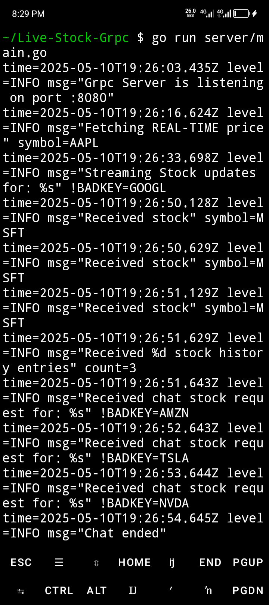

# 🚀 Live Stock GRPC: Real-Time Stock Data Streaming 📈

Get real-time stock prices and updates using gRPC! This project demonstrates how to build a high-performance, real-time stock data streaming service using Go and gRPC.

### Server Terminal (Running on Port 8080)


### Client Terminal (Fetching Stock Data)


## ⚙️ Installation

Follow these steps to set up the project locally:

- 👯 **Clone the Repository**:
  ```bash
  git clone https://github.com/samueltuoyo15/Live-Stock-Grpc.git
  cd Live-Stock-Grpc
  ```

- 🛠️ **Install Dependencies**:
  ```bash
  go mod download
  ```

- ⚙️ **Generate gRPC Stubs**:
  ```bash
  make proto
  ```

- 🚀 **Run the Server**:
  ```bash
  go run server/main.go
  ```

- 🏃 **Run the Client**:
  ```bash
  go run client/main.go
  ```

## 💻 Usage

### Running the Application

1.  **Start the gRPC Server**:

    ```bash
    go run server/main.go
    ```

    The server listens on port `8080`.

2.  **Execute the gRPC Client**:

    ```bash
    go run client/main.go
    ```

    The client will demonstrate unary, server streaming, client streaming, and bidirectional streaming RPCs.

### Example Usage

```go
// Example: Unary RPC
stockClient.GetStock("AAPL")

// Example: Server Streaming RPC
stockClient.WatchStock("GOOGL")

// Example: Client Streaming RPC
stockClient.UploadStockHistory([]*stockpb.StockRequest{
  { Symbol: "MSFT" },
  { Symbol: "MSFT" },
  { Symbol: "MSFT" },
})

// Example: Bidirectional Streaming RPC
stockClient.ChatStock([]*stockpb.StockRequest{
  { Symbol: "AMZN" },
  { Symbol: "TSLA" },
  { Symbol: "NVDA" },
})
```

## ✨ Features

- ⚡ **Real-Time Data**: Fetches stock prices in real-time.
- 📡 **gRPC Streaming**: Implements unary, server streaming, client streaming, and bidirectional streaming gRPC methods.
- 🧰 **Modular Design**: Well-structured code for easy maintenance and extension.
- 🪵 **Logging**: Utilizes `slog` for structured logging and debugging.
- 🔑 **API Integration**: Integrates with Alpha Vantage API for stock data.

## 🛠️ Technologies Used

| Technology       | Description                                                              | Link                                                                                       |
| :--------------- | :----------------------------------------------------------------------- | :----------------------------------------------------------------------------------------- |
| **Go**           | Programming language                                                     | [https://golang.org/](https://golang.org/)                                                |
| **gRPC**         | High-performance, open-source universal RPC framework                    | [https://grpc.io/](https://grpc.io/)                                                      |
| **Protocol Buffers** | Google's language-neutral, platform-neutral, extensible mechanism   | [https://developers.google.com/protocol-buffers](https://developers.google.com/protocol-buffers) |
| **Alpha Vantage API** | Real-time stock data                                                 | [https://www.alphavantage.co/](https://www.alphavantage.co/)                                |
| **godotenv**       | Loads environment variables from `.env` file                         | [https://github.com/joho/godotenv](https://github.com/joho/godotenv)                       |
| **slog**         | Structured logging package                                               | [https://pkg.go.dev/log/slog](https://pkg.go.dev/log/slog)                                  |

## 🤝 Contributing

We welcome contributions! Here's how you can help:

- 🐛 **Report Bugs**: Submit detailed bug reports to help improve the project.
- 💡 **Suggest Features**: Propose new features and enhancements.
- 🛠️ **Submit Pull Requests**: Contribute code changes, fixes, and improvements.

Please follow these guidelines when contributing:

- 📝 Use clear and descriptive commit messages.
- 🧪 Write tests for new features and bug fixes.
- 📖 Follow the existing code style.

## 🧑‍💻 Author Info

- Author: Samuel Tuoyo
  - Twitter: [https://x.com/TuoyoS26091]
  - LinkedIn: [https://www.linkedin.com/in/samuel-tuoyo-8568b62b6]

## Badges

[](https://golang.org)
[](https://grpc.io)

[](https://www.npmjs.com/package/dokugen)
