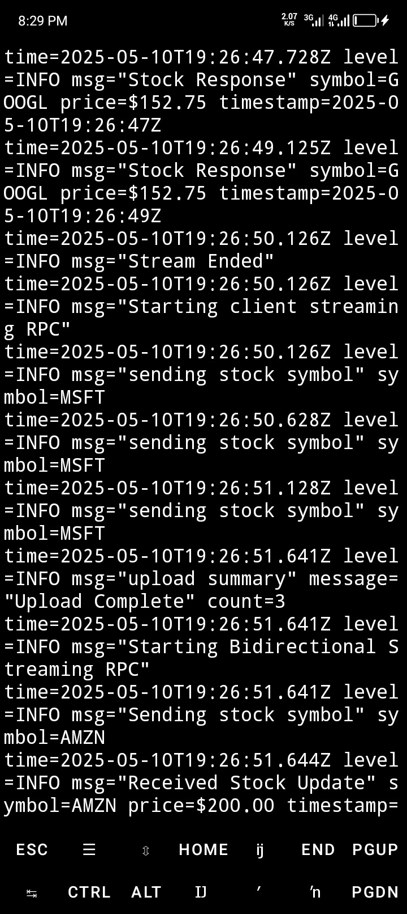

# ⚡️ Live Stock Tracker (gRPC) ⚡️

Real-time stock data streaming via gRPC! 📈 Get instant updates, historical data, and interactive stock chats. 💸

## 🖥️ Demo

### Server Terminal (Running on Port 8080)


### Client Terminal (Fetching Stock Data)


## ✨ Features

- ⚡️ **Unary RPC**: Fetch a single stock price.
- 📡 **Server Streaming**: Watch live stock updates.
- 📤 **Client Streaming**: Upload historical data.
- 💬 **Bi-directional Streaming**: Chat about stocks in real-time.

## 🛠️ Installation

Get started by cloning the repository and setting up the environment.

- ⬇️ **Clone the Repository**:

```bash
git clone https://github.com/samueltuoyo15/Live-Stock-Grpc.git
cd Live-Stock-Grpc
```

- ⚙️ **Install Dependencies**:

Make sure you have Go installed. Then, download the necessary modules:

```bash
go mod download
```

- 🔨 **Compile Proto Files**:

Generate Go files from the protobuf definitions:

```bash
make proto
```

## 🚀 Usage

### Run the Server

```bash
cd server
go run main.go
```

### Run the Client

```bash
cd client
go run main.go
```

<details>
<summary>Detailed Usage Instructions</summary>

1.  **Start the gRPC Server**:

    *   Navigate to the `server` directory.
    *   Run the `main.go` file to start the server. This will listen on port `8080`.

    ```bash
    cd server
    go run main.go
    ```

2.  **Run the gRPC Client**:

    *   Open a new terminal and navigate to the `client` directory.
    *   Run the `main.go` file to start the client. The client will connect to the server and demonstrate the various gRPC methods.

    ```bash
    cd client
    go run main.go
    ```

3.  **Observe the Output**:

    *   The server will log incoming requests and stream stock updates.
    *   The client will display the responses from the server, showcasing unary, server streaming, client streaming, and bi-directional streaming RPCs.
</details>

## 🖥️ Technologies Used

| Technology   | Link                                                                       |
| :----------- | :------------------------------------------------------------------------- |
| Go           | [https://go.dev/](https://go.dev/)                                          |
| gRPC         | [https://grpc.io/](https://grpc.io/)                                        |
| Protocol Buffers | [https://protobuf.dev/](https://protobuf.dev/)                                  |

## 🤝 Contributing

Contributions are welcome! Here's how you can help:

- 🐛 **Report Bugs**: Submit detailed bug reports.
- 💡 **Suggest Features**: Propose new features and improvements.
- ✍️ **Contribute Code**: Submit pull requests with well-documented code.

## 📜 License

This project is under the [MIT License](LICENSE).

## 🧑‍💻 Author Info

- Author: Samuel Tuoyo
  - Twitter: [https://x.com/TuoyoS26091]
  - LinkedIn: [https://www.linkedin.com/in/samuel-tuoyo-8568b62b6]

[](https://go.dev/)
[](https://grpc.io/)
[](https://opensource.org/licenses/MIT)

[](https://www.npmjs.com/package/dokugen)
